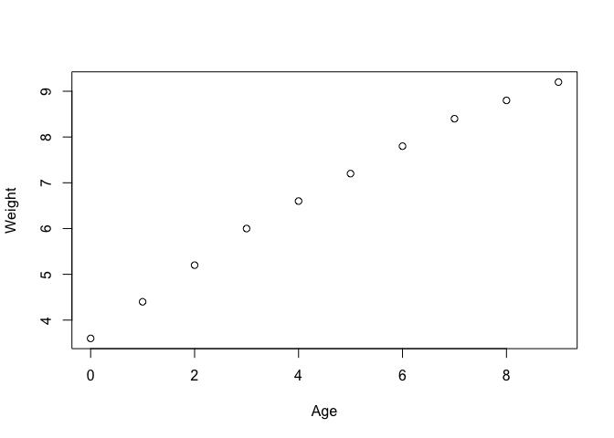
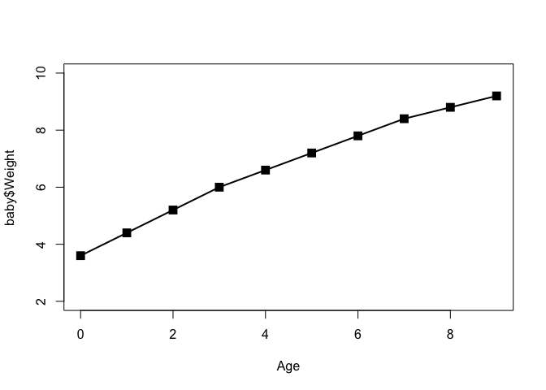
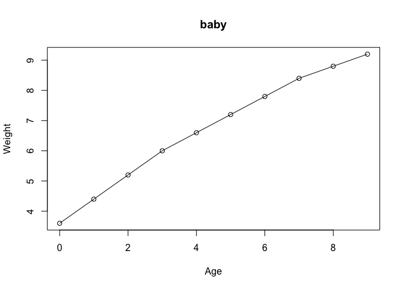
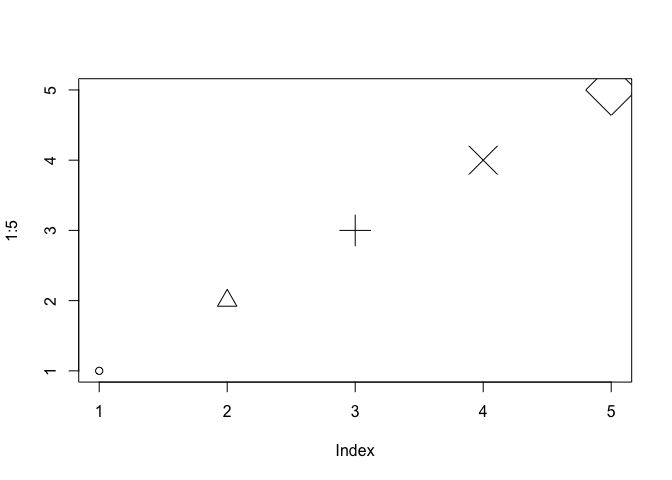
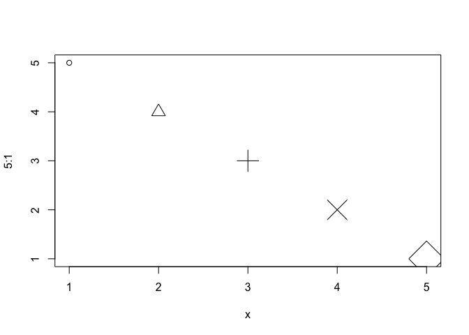
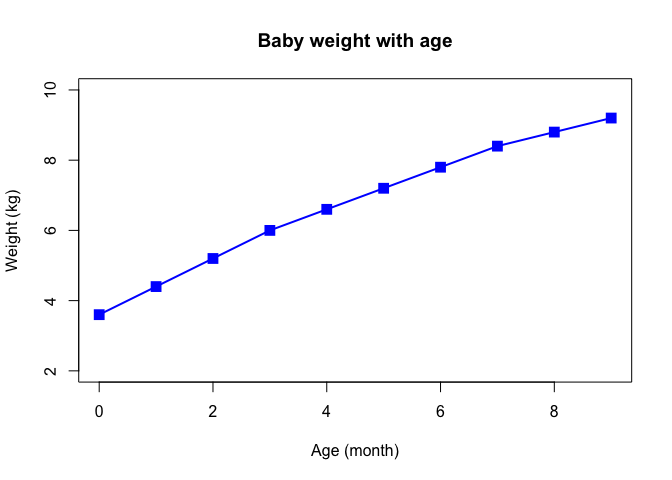
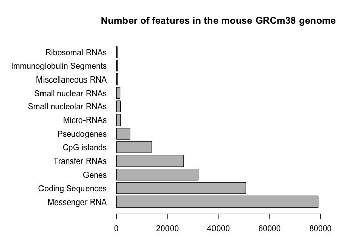
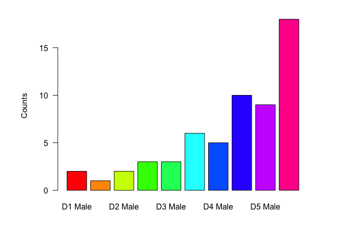

class05
================
LilyWu
2019-10-31

# Section 2A scatterplots

``` r
# lets read our input file first

read.table("bimm143_05_rstats/weight_chart.txt")
```

    ##     V1     V2
    ## 1  Age Weight
    ## 2    0    3.6
    ## 3    1    4.4
    ## 4    2    5.2
    ## 5    3      6
    ## 6    4    6.6
    ## 7    5    7.2
    ## 8    6    7.8
    ## 9    7    8.4
    ## 10   8    8.8
    ## 11   9    9.2

``` r
baby <- read.table("bimm143_05_rstats/weight_chart.txt")
baby <- read.table("bimm143_05_rstats/weight_chart.txt",header=TRUE)

#plot the basic scatterplot and convert it to a line plot 
plot(baby)
```

<!-- -->

``` r
plot(baby$Age, baby$Weight,type = "o",pch=15,cex=1.5,lwd=2,ylim=c(2,10),xlab="Age")
```

<!-- -->

``` r
plot(baby$Age, baby$Weight,type = "o",ylab="Weight",xlab="Age",main="baby")
```

<!-- -->

``` r
# cex = character size 
# pch = character type 
plot(1:5,pch=1:5,cex=1:5)
```

<!-- -->

``` r
plot(5:1,pch=1:5,cex=1:5,xlab="x")
```

<!-- -->

``` r
#generate the required plot for 2a
plot(baby$Age, baby$Weight,type = "o",ylim=c(2,10),ylab="Weight (kg)",xlab="Age (month)",main="Baby weight with age",lwd=2,pch=15,cex=1.5,col="blue")
```

<!-- -->

``` r
# Section 2B barplot
read.table("bimm143_05_rstats/feature_counts.txt",sep="\t",header=TRUE)
```

    ##                    Feature Count
    ## 1            Messenger RNA 79049
    ## 2         Coding Sequences 50770
    ## 3                    Genes 32029
    ## 4            Transfer RNAs 26248
    ## 5              CpG islands 13840
    ## 6              Pseudogenes  5195
    ## 7               Micro-RNAs  1638
    ## 8     Small nucleolar RNAs  1602
    ## 9       Small nuclear RNAs  1431
    ## 10       Miscellaneous RNA   491
    ## 11 Immunoglobulin Segments   474
    ## 12          Ribosomal RNAs   341

``` r
mouse <- read.delim("bimm143_05_rstats/feature_counts.txt")
mouse
```

    ##                    Feature Count
    ## 1            Messenger RNA 79049
    ## 2         Coding Sequences 50770
    ## 3                    Genes 32029
    ## 4            Transfer RNAs 26248
    ## 5              CpG islands 13840
    ## 6              Pseudogenes  5195
    ## 7               Micro-RNAs  1638
    ## 8     Small nucleolar RNAs  1602
    ## 9       Small nuclear RNAs  1431
    ## 10       Miscellaneous RNA   491
    ## 11 Immunoglobulin Segments   474
    ## 12          Ribosomal RNAs   341

``` r
par(mar=c(3,12,4.1,2))
barplot (mouse$Count, names.arg = mouse$Feature, horiz = "True",las=1,xlim=c(0,80000),main="Number of features in the mouse GRCm38 genome")
```

<!-- -->

``` r
#Section 2C Histograms
read.delim("bimm143_05_rstats/male_female_counts.txt")
```

    ##       Sample Count
    ## 1    D1 Male     2
    ## 2  D1 Female     1
    ## 3    D2 Male     2
    ## 4  D2 Female     3
    ## 5    D3 Male     3
    ## 6  D3 Female     6
    ## 7    D4 Male     5
    ## 8  D4 Female    10
    ## 9    D5 Male     9
    ## 10 D5 Female    18

``` r
color <-read.delim("bimm143_05_rstats/male_female_counts.txt")
color
```

    ##       Sample Count
    ## 1    D1 Male     2
    ## 2  D1 Female     1
    ## 3    D2 Male     2
    ## 4  D2 Female     3
    ## 5    D3 Male     3
    ## 6  D3 Female     6
    ## 7    D4 Male     5
    ## 8  D4 Female    10
    ## 9    D5 Male     9
    ## 10 D5 Female    18

``` r
par(mar=c(5,6,2,3))
barplot (color$Count,ylab="Counts",names.arg=color$Sample, col=rainbow(nrow(color)),las=1)
```

<!-- -->
