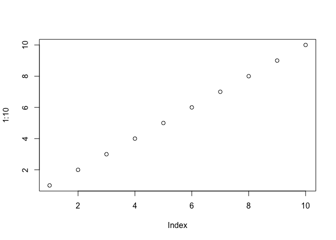

class06
================
Yutong Wu
10/17/2019

# This is H1

This is my work from class6 in **BIMM143**.

## This is heading 2

### This is heading 3 etc.

``` r
# this is to demo a code chunk 
plot(1:10)
```

<!-- -->

\#Practice reading files (again…)

``` r
read.csv("test1.txt")
```

    ##   Col1 Col2 Col3
    ## 1    1    2    3
    ## 2    4    5    6
    ## 3    7    8    9
    ## 4    a    b    c

``` r
read.table("test2.txt",sep="$",header=TRUE)
```

    ##   Col1 Col2 Col3
    ## 1    1    2    3
    ## 2    4    5    6
    ## 3    7    8    9
    ## 4    a    b    c

``` r
read.table("test3.txt",header=TRUE)
```

    ##   X1 X6 a
    ## 1  2  7 b
    ## 2  3  8 c
    ## 3  4  9 d
    ## 4  5 10 e

``` r
add <- function(x, y=1) {
  
  # Sum the input x and y
  
  x + y
}
```

A new function to re-scale data

``` r
rescale <- function(x) {
  rng <- range(x)
  (x-rng[1])/(rng[2]-rng[1])
}
```

``` r
rescale(1:10)
```

    ##  [1] 0.0000000 0.1111111 0.2222222 0.3333333 0.4444444 0.5555556 0.6666667
    ##  [8] 0.7777778 0.8888889 1.0000000

``` r
rescale(c(1,2,NA,3,10))
```

    ## [1] NA NA NA NA NA

``` r
x <- c(1,2,NA,3,10)
rng <- range(x, na.rm=TRUE)
```

# Section2 of hands-on sheet

Install the **bio3d** package for sequence and structure analysis

``` r
#install.ockages("bio3d")
```

``` r
library(bio3d) #call the functions in bio3d package
s1 <- read.pdb("4AKE")  # kinase with drug
```

    ##   Note: Accessing on-line PDB file

``` r
s2 <- read.pdb("1AKE")  # kinase no drug
```

    ##   Note: Accessing on-line PDB file
    ##    PDB has ALT records, taking A only, rm.alt=TRUE

``` r
s3 <- read.pdb("1E4Y")  # kinase with drug
```

    ##   Note: Accessing on-line PDB file

``` r
s1.chainA <- trim.pdb(s1, chain="A", elety="CA")
s2.chainA <- trim.pdb(s2, chain="A", elety="CA")
s3.chainA <- trim.pdb(s3, chain="A", elety="CA")
# A specific alpha strand on the specific chain of the protein 


s1.b <- s1.chainA$atom$b
s2.b <- s2.chainA$atom$b
s3.b <- s3.chainA$atom$b

#The file that indicates the atom position b at Chain A of the protein 

plotb3(s1.b, sse=s1.chainA, typ="l", ylab="Bfactor", top = FALSE)
```

<!-- -->

``` r
plotb3(s2.b, sse=s2.chainA, typ="l", ylab="Bfactor")
```

<!-- -->

``` r
plotb3(s3.b, sse=s3.chainA, typ="l", ylab="Bfactor")
```

<!-- -->

``` r
#drug affects the mobility of the protein (affect phosphortransferase action)
#Draw a line plot that describes atom postion b at Chain A of each specific protein with optional secondary structure in the marginal regions 
```

``` r
test<-function(x){
  s1 <- read.pdb(x)
  s1.chainA <- trim.pdb(s1, chain="A", elety="CA")
  s1.b <- s1.chainA$atom$b
  plotb3(s1.b, sse=s1.chainA, typ="l", ylab="Bfactor")
}
```

``` r
test("4AKE")
```

    ##   Note: Accessing on-line PDB file

    ## Warning in get.pdb(file, path = tempdir(), verbose = FALSE): /var/folders/
    ## fm/lj0vdy1j63g9rd1q5q93xsyh0000gn/T//RtmpMvgoeG/4AKE.pdb exists. Skipping
    ## download

<!-- -->

``` r
test("1AKE")
```

    ##   Note: Accessing on-line PDB file

    ## Warning in get.pdb(file, path = tempdir(), verbose = FALSE): /var/folders/
    ## fm/lj0vdy1j63g9rd1q5q93xsyh0000gn/T//RtmpMvgoeG/1AKE.pdb exists. Skipping
    ## download

    ##    PDB has ALT records, taking A only, rm.alt=TRUE

<!-- -->

``` r
test("1E4Y")
```

    ##   Note: Accessing on-line PDB file

    ## Warning in get.pdb(file, path = tempdir(), verbose = FALSE): /var/folders/
    ## fm/lj0vdy1j63g9rd1q5q93xsyh0000gn/T//RtmpMvgoeG/1E4Y.pdb exists. Skipping
    ## download

<!-- -->
