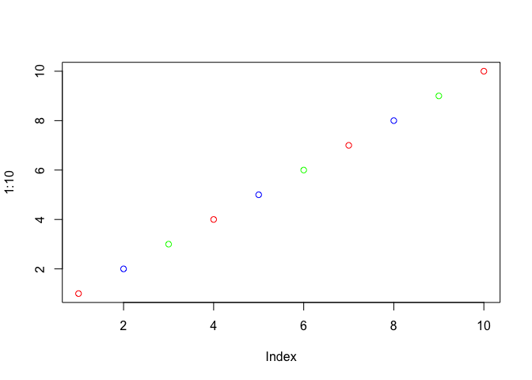

Class 7 R functions and packages
================
Yutong Wu
10/22/2019

\#R functions revisited

Source my functions from last
    day

``` r
source("http://tinyurl.com/rescale-R")
```

``` r
rescale(1:10)
```

    ##  [1] 0.0000000 0.1111111 0.2222222 0.3333333 0.4444444 0.5555556 0.6666667
    ##  [8] 0.7777778 0.8888889 1.0000000

``` r
rescale(c(1,10,5,NA,6))
```

    ## [1] 0.0000000 1.0000000 0.4444444        NA 0.5555556

\!is.numeric() \! flips the logical value output from the function

## A new function called both\_na()

Write a function to find where there re NA elements in two input
vectors.

First makes some simple inuput hwere I know the answers.

``` r
x <- c( 1, 2, NA, 3, NA)
y <- c(NA, 3, NA, 3, 4)
```

Looked online and found the **is.na()** function

``` r
is.na(x)
```

    ## [1] FALSE FALSE  TRUE FALSE  TRUE

and the **which()** function tells me where the TRUE values are

``` r
which(is.na(x))
```

    ## [1] 3 5

``` r
which(is.na(y))
```

    ## [1] 1 3

``` r
is.na(x)
```

    ## [1] FALSE FALSE  TRUE FALSE  TRUE

``` r
is.na(y)
```

    ## [1]  TRUE FALSE  TRUE FALSE FALSE

The AND function requries two input TRUE to give a TRUE output

``` r
is.na(x) & is.na(y)
```

    ## [1] FALSE FALSE  TRUE FALSE FALSE

Taking the **sum()** of TRUE FALSE vector will tell me how many TRUE
elements I have. This is my working snippet\!

``` r
sum(is.na(x) & is.na(y))
```

    ## [1] 1

``` r
#TRUE represents 1 in R and FALSE equals 0
```

``` r
#TRUE represents 1 in R and FALSE equals 0
```

Now turn it into a function.

``` r
both_na <- function (x,y) {
  sum(is.na(x) & is.na(y))
}
```

``` r
both_na(x,y)
```

    ## [1] 1

``` r
x <- c(1, NA, NA)
y1 <- c( 1, NA, NA)
y2 <- c( 1, NA, NA, NA, NA, NA, NA)
both_na(x,y2)
```

    ## Warning in is.na(x) & is.na(y): longer object length is not a multiple of
    ## shorter object length

    ## [1] 4

``` r
both_na(x,y1)
```

    ## [1] 2

Show how R recycles

``` r
plot(1:10, col=c("red","blue","green"))
```

<!-- -->

``` r
length(x)
```

    ## [1] 3

``` r
length(y2)
```

    ## [1] 7

``` r
both_na <- function (x,y) {
  
  if (length(x)!= length(y)) {
    z <- length (x) != length(y)
    stop("Inputs x and y should be the same length!")
  }
  sum(is.na(x) & is.na(y))
}
```

``` r
x1 <- c(100, 100, 100, 100, 100, 100, 100, 90)
x2 <- c(100, NA, 90, 90, 90, 90, 97, 80)
```

``` r
grade <- function (x) {
  if (sum(is.na(x)) > 0) {
    return(x[-which(is.na(x))])
  }
  min <- min(x)
  x[-which.min(x)]
}
```

``` r
grade(x1)
```

    ## [1] 100 100 100 100 100 100 100

``` r
which.min(x2)
```

    ## [1] 8

``` r
x2[-which.min(x2)]
```

    ## [1] 100  NA  90  90  90  90  97

``` r
mean(x2[-which.min(x2)], na.rm = TRUE)
```

    ## [1] 92.83333

``` r
any(is.na(x2))
```

    ## [1] TRUE

``` r
any(is.na(x1))
```

    ## [1] FALSE

We have our workin gcode now turn it into a first function

``` r
grade <- function(x) {
  if (any(is.na(x))) {
    warning("Student is missing a homework")
  }
  mean ( x[-which.min(x)], na.rm=TRUE)
}
```

``` r
grade(x1)
```

    ## [1] 100

``` r
grade(x2)
```

    ## Warning in grade(x2): Student is missing a homework

    ## [1] 92.83333

``` r
url <- "https://tinyurl.com/gradeinput"
hw <- read.csv(url, row.names=1)

hw
```

    ##            hw1 hw2 hw3 hw4 hw5
    ## student-1  100  73 100  88  79
    ## student-2   85  64  78  89  78
    ## student-3   83  69  77 100  77
    ## student-4   88  NA  73 100  76
    ## student-5   88 100  75  86  79
    ## student-6   89  78 100  89  77
    ## student-7   89 100  74  87 100
    ## student-8   89 100  76  86 100
    ## student-9   86 100  77  88  77
    ## student-10  89  72  79  NA  76
    ## student-11  82  66  78  84 100
    ## student-12 100  70  75  92 100
    ## student-13  89 100  76 100  80
    ## student-14  85 100  77  89  76
    ## student-15  85  65  76  89  NA
    ## student-16  92 100  74  89  77
    ## student-17  88  63 100  86  78
    ## student-18  91  NA 100  87 100
    ## student-19  91  68  75  86  79
    ## student-20  91  68  76  88  76

``` r
apply(hw,1,grade)
```

    ## Warning in FUN(newX[, i], ...): Student is missing a homework
    
    ## Warning in FUN(newX[, i], ...): Student is missing a homework
    
    ## Warning in FUN(newX[, i], ...): Student is missing a homework
    
    ## Warning in FUN(newX[, i], ...): Student is missing a homework

    ##  student-1  student-2  student-3  student-4  student-5  student-6 
    ##   91.75000   82.50000   84.25000   88.00000   88.25000   89.00000 
    ##  student-7  student-8  student-9 student-10 student-11 student-12 
    ##   94.00000   93.75000   87.75000   81.33333   86.00000   91.75000 
    ## student-13 student-14 student-15 student-16 student-17 student-18 
    ##   92.25000   87.75000   83.33333   89.50000   88.00000   97.00000 
    ## student-19 student-20 
    ##   82.75000   82.75000

``` r
#1 represents row, 2 represents column
```
