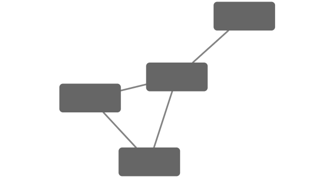
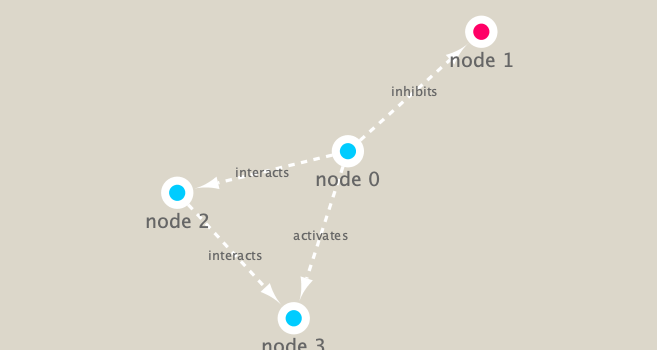

```{r setup, include=FALSE}
knitr::opts_chunk$set(echo = TRUE)
```

## Metagenomics co-occurrence networks

Here examine data from the Tara OCean project on bacteria in ocean water samples from around the world.

We will use the **igraph** package from CRAN and the *RCy3** package from bioconductor to build and visualize networks if this data. 


```{r}
# igraph is from CRAN, RCy3 is from Bioconductor
# To install packages from CRAN: install.packages("igraph")
# To install pacages from Bioconductor: BiocManager::install("RCy3")
```

```{r}
# Load the packages 
library(RCy3)
library(igraph)
```

```{r}
# Test the connection to Cytoscape. 
cytoscapePing()
```

```{r}
g <- makeSimpleIgraph()
createNetworkFromIgraph(g,"myGraph")
```

```{r}
plot(g)
```

Tell cytoscape to export an image (screenshot)
```{r}
fig <- exportImage(filename="demo", type="png", height=350)
```

Insert this image into this Rmd report
```{r}

```

Change the cytoscape display style
```{r}
setVisualStyle("Marquee")
```

save and include image here in this report
```{r}
fig <- exportImage(filename="demo_marquee", type="png", height=350)

```


## Read our metagenomics data set
```{r}
prok_vir_cor <- read.delim("~/downloads/virus_prok_cor_abundant.tsv", stringsAsFactors = FALSE)
head(prok_vir_cor)

```

Create an undirected network from this agecency data.frame
```{r}
g <- graph.data.frame(prok_vir_cor, directed = FALSE)
plot(g)
```


This is a whole mess! lets change the labels and note size for the figure
```{r}
plot(g, vertex.size=3, vertex.label=NA)
```
 
 
 To send this network to Cytocape we can use the command 
```{r}
createNetworkFromIgraph(g,"myIgraph")
```
 
 


